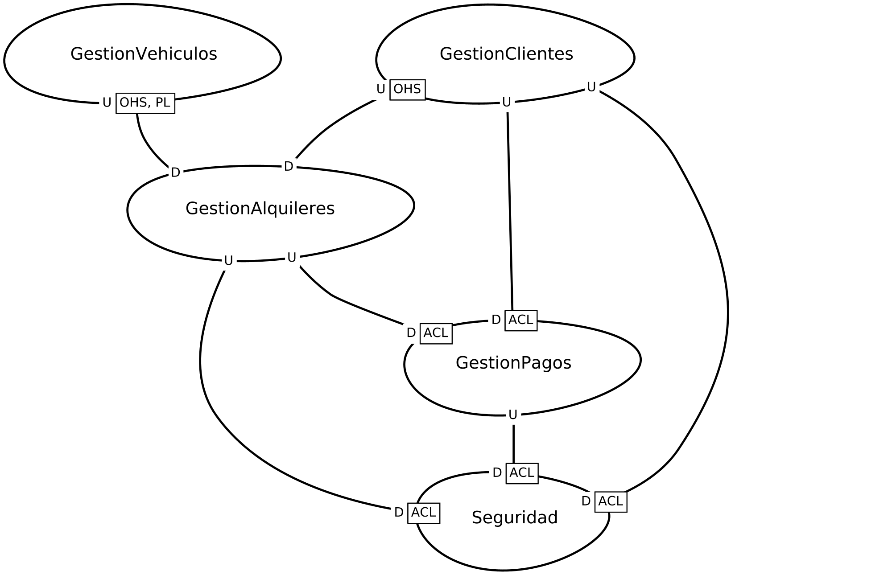

# SWIIIHuamanAlquiler
## Identificacion de subdominos
### Gestion de alquileres
Es un dominio del tipo CORE, esto porque es el giro principal del negocio que trata sobre el alquilar vehiculos a los clientes.
### Gestion de Pagos
Es un dominio de tipo CORE, esto porque representa porque representa una parte fundamental del proceso de adquisición de un vehiculo por medio de su alquiler.
### Gestion de Clientes
Es un dominio de tipo SOPORTTE, esto porque es necesario para generar valor del negocio, pero no lo suficiente como el de Alquileres, ya que funciona como ayuda al mismo (Alquileres), para obtener una ventaja estrategica.
### Gestion de Vehiculos
Es un dominio de tipo SOPORTTE, esto porque es necesario para generar valor del negocio, pero no lo suficiente como el de Alquileres, ya que funciona como ayuda al mismo (Alquileres), para obtener una ventaja estrategica con la informacion de los vehiculos que se obtienen.

### Seguridad
Es un dominio de tipo GENERICO, esto porque no proporciona un valor unico al negocio, sino que es usado por diversos negocios para un mismo fin.

## Identificacion de BoundedContext

- BoundedContext GestionAlquileres
- BoundedContext GestionClientes
- BoundedContext GestionVehiculos
- BoundedContext GestionPagos
- BoundedContext Seguridad

## Patrones de integracion entre BoundedContext

### GestionClientes y Seguridad (Anticorrupcion)
Usa un patron de ANTICORRUPCION porque, ademas de ser segura al compartir datos (necesaria para la seguridad), se encarga de colocar una capa de traduccion para que la integridad este protegida, es decir, la seguridad se encargara de traducir la gestion de clientes.

### GestionPagos y Seguridad (Anticorrupcion)
Usa un patron de ANTICORRUPCION por la seguridad que ofrece, necesaria en procesos de Pagos, ademas de que se encarga de proteger la informacion adecuadamente por medio de su capa de traduccion.

### GestionAlquileres y Seguridad (Anticorrupcion)
Usa un patron de ANTICORRUPCION por la seguridad que ofrece, necesaria epara proteger informacion confidencial de los alquileres realizados por medio de su capa de traduccion.

### GestionVehiculos y GestionAlquileres (Open-Host Service - Lenguaje Publicado)
Usa un patron de Open-Host Service y Lenguaje Publicado ya que ofrece la opcion de generar una intefaz para acceder a la informacion de Vehiculos y determinar los datos necesarios para su posterior alquiler, ademas de contar con un lenguaje publicado para que la comprencion del lenguaje sea más eficiente.

### GestionClientes y GestionPagos (Anticorrupcion)
Usa un patron de ANTICORRUPCION por la seguridad que ofrece, necesaria en procesos de Pagos, ademas de que se encarga de proteger la informacion adecuadamente de los clientes y el proceso de pago por medio de su capa de traduccion.

### GestionAlquileres y GestionPagos (Anticorrupcion)
Usa un patron de ANTICORRUPCION por la seguridad que ofrece, necesaria en procesos de Pagos, ademas de que se encarga de proteger la informacion adecuadamente de los Alquileres relizadas por el negocio por medio de su capa de traduccion.

### GestionClientes y GestionAlquileres (Open-Host Service)
Usa un patron de Open-Host Service, ya que ofrece la opcion de generar una intefaz para acceder a la informacion de Clientes y determinar los datos de los mismos para determinar el alquiler.

## Mapa de contexto

